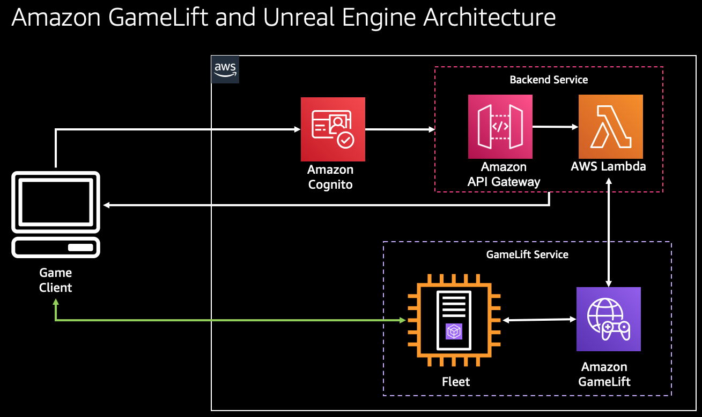

# Amazon GameLift with Unreal Engine

This repository contains code used for the video series, [Building Games on AWS: Amazon GameLift with Unreal Engine](https://www.youtube.com/playlist?list=PLuGWzrvNze7LEn4db8h3Jl325-asqqgP2). For the full guide, please see the video series.

This repository includes:
* AWS Lambda function code for getting available GameLift sessions
* AWS Lambda function code for authentication with Cognito
* Unreal Engine client code for logging in and connecting to a GameLift server through Amazon API Gateway

Code as referenced in each video episode:
* Episode 5 -> [lambda/GameLiftUnreal-StartGameLiftSession.py](lambda/GameLiftUnreal-StartGameLiftSession.py)
* Episode 6 -> [lambda/GameLiftUnreal-CognitoLogin.py](lambda/GameLiftUnreal-CognitoLogin.py)
* Episode 7 -> [unreal/OfflineMainMenuWidget.cpp](unreal/OfflineMainMenuWidget.cpp), [unreal/OfflineMainMenuWidget.h](unreal/OfflineMainMenuWidget.h)

## Security

See [CONTRIBUTING](CONTRIBUTING.md#security-issue-notifications) for more information.

## License

This library is licensed under the MIT-0 License. See the LICENSE file.

